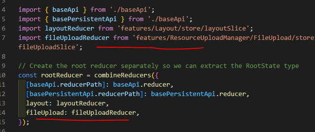

# Redux Store Documentations

For global state management, we are using Redux with RTK Query.
Our store have 2 categories: `Services` and `Slices`.

## Services
These are store that can call Web APIs and store the result to the global state automatically. I declated 2 baseApis for this 
- `baseApi` - used for ordinary API calls (shorter cache expiration)
- `basePersistentApi` - used for Api calls where the data fetched should persist for a long time (i declared 3600 seconds). This is mostly used for Select dropdown data that comes from backend.

## Slices
If you've used the old Redux, declaring a slice is the same with declaring a global state. Slices are basically just a global state you defined. But since we are using a Domain Driven Design, even though slices were technically global, I suggest to put them where they are needed.

For example, the `FileUpload` needs a slice because it needs to have a state that are easily accessible and monitored by a lot of FileUploaders. In this case, we create the `slice` inside `scr/features/ResourceUploadManager/FileUpload` domain instead of creating it at the global store which is at `src/store`. The reason for this is that, even though technically it is a global state, the only once that needs it are the file uploader.

 

# Steps in Creating a Slice
1. Create a `store` folder inside the folder/domain where the slice would be used.
2. Create a slice file inside it and name it with the ComponentGroupName + Slice at the end. ie. If it is being used inside 'FileUpload' folder, slice name would be `fileUploadSlice.ts`
3. Inside `fileUploadSlice.ts`, declare everything necessary like the states, reducers, actions, etc. (Refer to other existing slices for the structure).
4. Once done, go to `src/store/store.ts` and import the reducer of the slice you created and add it to `rootReducer` at combine reducer. 
5. Go to `src/helpers/testHelpers.ts` and do the same thing as #4.

Now try to run the code and see if it works.

 

[Go back to Main Page](../../README.md)